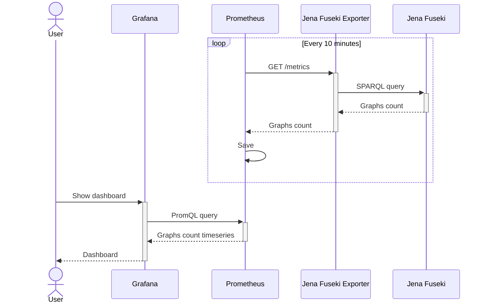

# Jena Fuseki Exporter

## Overview

The application exports information about the number of graphs from Apache Jena Fuseki to Prometheus. It was created forfor performance monitoring of the database.

## Development
How to start locally
1. `ray sync`
1. `. .venv/bin/activate`
1. `fastapi dev src/jena_fuseki_exporter/main.py`

The repo contains a GitHub action. It builds and publishes a container image, and publishes a Helm chart. To trigger it, set a Git tag.
