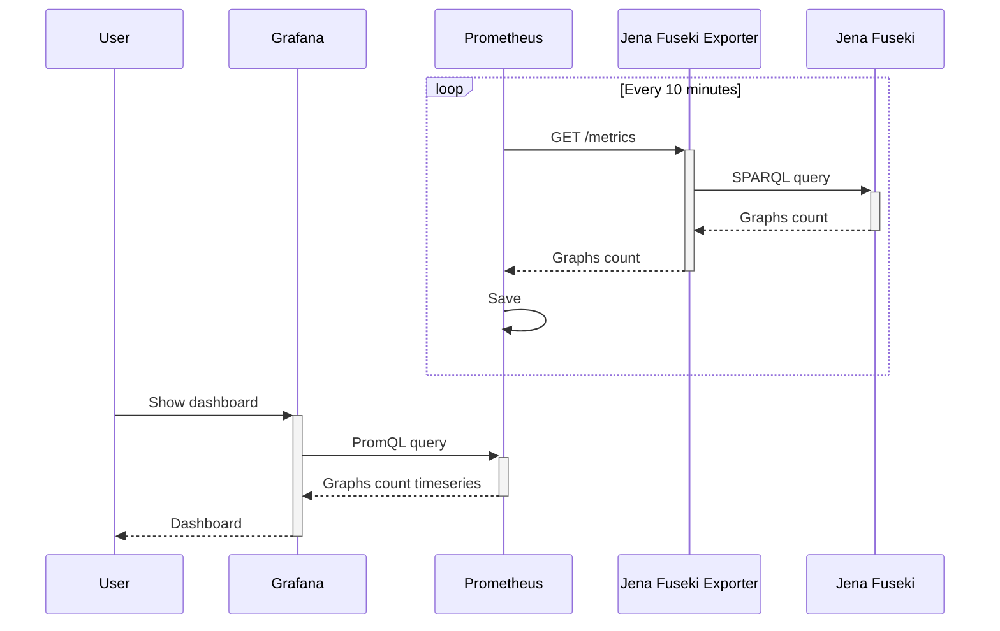

# Jena Fuseki Exporter

The application exports information about the number of graphs from Apache Jena Fuseki to Prometheus. It was created forfor performance monitoring of the database.

```mermaid
sequenceDiagram
    participant User
    participant Grafana
    participant Prometheus
    participant Jena Fuseki Exporter
    participant Jena Fuseki Exporter
    loop Every 10 minutes
        Prometheus->>+Jena Fuseki Exporter: GET /metrics
        Jena Fuseki Exporter->>+Jena Fuseki: SPARQL query
        Jena Fuseki-->>-Jena Fuseki Exporter: Graphs count
        Jena Fuseki Exporter-->>-Prometheus: Graphs count
        Prometheus->>Prometheus: Save
    end
    User->>+Grafana: Show dashboard
    Grafana->>+Prometheus: PromQL query
    Prometheus-->>-Grafana: Graphs count timeseries
    Grafana-->>-User: Dashboard
```
